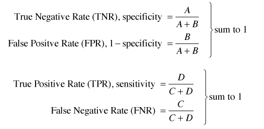

##### **Regression:** Regression analysis is a predictive modelling techinque. It esimates the relationship between a dependent(target) and an independent variable(predictor). 

##### **Logistic Regression:** Logistic regression is a classification algorithm. When the dependent variable is categorical(0/1, True/False, Yes/No, A/B/C) in nature, we use logistic regression. You can also think of logistic regression as a special case of linear regression when the outcome variable is categorical, where we are using log of odds as dependent variable. In simple words, it predicts the probability of occurrence of an event by fitting data to a logit function.


 Linear Equation: $$Y= mX + C $$,  Range of Y is from -infinity to +infinity
 
 Let's try to reduce the Logistic Regression Equation from this equation as Logistic Equation, Y can only be between 0 and 1.
 
 $$(Y/1-Y)  $$, 
 
 now for Y=0, the overall value will be 0 and for Y=1, the overall value will be infinity
 
 Now taking log, $$ln(Y/1-Y) $$, 
 now for Y=0, the overall value will be -infinity and for Y=1, the overall value will be infinity.
 So, the reduced logistic equation would be:
 $$ln(Y/1-Y) = mX + C$$
**Logistic Regression is same as like of Linear regression only difference is in ouput, for logistic regression it's in between 0 & 1 whereas for linear regression it's -infinity & +infinity.**
 
####Important Points

1. GLM does not assume a linear relationship between dependent and independent variables. However, it assumes a linear relationship between link function and independent variables in logit model.
2. The dependent variable need not to be normally distributed.
3. It does not uses OLS (Ordinary Least Square) for parameter estimation. Instead, it uses maximum likelihood estimation (MLE).
4. Errors need to be independent but not normally distributed

#### Steps Involved in performing Logistic Regression algorithm:
1. Data Collection.
2. Preparing and exploring the data.
      * Understnding data structure.
      * Feature selection (if required)
      * Creating Training and Test data set.
3. Training a model on data.
4. Evaluate the model performance.
      * Use of ConfusionMatrix to evaluate accuracy.
      * Plot ROC curve to understand True Positive Rate(Sensitivity) and False Positvie Rate (1-Specificity).
5. Improve the performance of model.
      * Find the optimal threshold for maximum accuracy.

### *Logistic Regression algorithm*

##### **Case Study -1**

#### **Objective of Analysis**: *To identify whether a patient has diabetes or not.*

#####About this dataset

This dataset is originally from the National Institute of Diabetes and Digestive and Kidney Diseases. The objective is to predict whether a patient has diabetes or not based on diagnostic measurements .

####Dataset information

Several constraints were placed on the selection of these instances from a larger database. In particular, all patients here are females at least 21 years old of Pima Indian heritage.

**Step-1 Data Collection.**

```{r}
diabetes <- read.csv("diabetes.csv",stringsAsFactors = F,header = T) # reading csv data files from defined directory as file has already downloaded and stored in the directory
diabetes$Outcome <- as.factor(diabetes$Outcome)

```

**Step-2 Preparing and exploring the data.**

```{r}
str(diabetes) # understanding data structure, can see all the varaibles are either integers or numbers except 'Outcome' which is a factor and also our response/target variable.

#Creating Training and Test data set.
set.seed(123) # To get the same random sample
train <- sample(1:nrow(diabetes),size=nrow(diabetes)*0.7) #random selection of 70% data.
diabetes_train <- diabetes[train,]  # 70% training data
diabetes_test <- diabetes[-train,]  # remaining 30% test data
```

**Step-3 Training a model on data.**
```{r}
model <- glm(Outcome~.,data=diabetes_train,family = 'binomial') # glm is the function used for 'Logistic Regression algorithm' and '~.' used to include all the features/attributes to train the model.
summary(model)  # To get the summary of model

```

* **AIC (Akaike Information Criteria)** * - The analogous metric of adjusted R² in logistic regression is AIC. AIC is the measure of fit which penalizes model for the number of model coefficients. Therefore, we always prefer model with minimum AIC value.

* **Null Deviance and Residual Deviance** * - Null Deviance indicates the response predicted by a model with nothing but an intercept. Lower the value, better the model. Residual deviance indicates the response predicted by a model on adding independent variables. Lower the value, better the model.

* **Significance Level** * - P -Value = 0.001 for 3 times aestrik, 0.01 for 2 times aestrik, 0.05 for 1 time aestrik, 0.1 for '.'' and more than 0.1 no symbol. So, we can play with feature selections based on significant level and check whether there is any improvement in NULL Deviance and Residual Deviance and accordingly we can drop any feature if required.
```{r}
#Predicting the target value for test data based on model using 'predict' function
predictions <- predict(model,newdata=diabetes_test,type="response")
predictions <- round(predictions)

```

**Step-4 Evaluate the model performance.**
```{r}
mean(predictions==diabetes_test$Outcome)  # To find the accuracy of prediction
```
```{r}
#confusion matrix using 'table' function
table(diabetes_test$Outcome, predictions > 0.5) # tabular form of actual outcome against predicted outcome for threshold > 0.5 

```

**Install.packages(caret)**, *To install 'caret' packages as it carries 'confusion matrix' function  which helps in the calculation of accuracy of model.*
```{r include=FALSE}

library(caret)
```
```{r eval=FALSE}

library(caret)

```
```{r}
predictions>0.5
predict.con <-as.factor(predictions) # converting logical value to factor value

confusionMatrix(diabetes_test$Outcome,predict.con)

```
  ***Let's understand the theory behind confusion matrix.***
  
It gives tabular form of predicted values against actual values or actual values against predicted value depends on the way we put the data in the 'confusionMatrix' funcion.

**Reference**

|  Predicted	|  Event | No Event  |
|-------------|:------:|----------:|
| Event	      |   A    |   B       |
| No Event    |   C    |   D       |


The formulas used here are:

Sensitivity = A/(A+C)

Specificity = D/(B+D)

Prevalence = (A+C)/(A+B+C+D)

Pos Pred Value = (sensitivity * prevalence)/((sensitivity*prevalence) + ((1-specificity)*(1-prevalence)))

Neg Pred Value = (specificity * (1-prevalence))/(((1-sensitivity)*prevalence) + ((specificity)*(1-prevalence)))

Detection Rate = A/(A+B+C+D)

Detection Prevalence = (A+B)/(A+B+C+D)

Balanced Accuracy = (sensitivity+specificity)/2

Precision = A/(A+B)

Recall = A/(A+C)

#### **OR in other way**


### **Accuracy of the model can be calculated using formula:**


### * **Some important parameters in understanding accuracy and plotting of ROC curve** * 




**ROC:** Receiver Operating Characteristic(ROC) summarizes the model's performance by evaluating the trade offs between true positive rate (sensitivity) and false positive rate(1- specificity). For plotting ROC, it is advisable to assume p > 0.5 since we are more concerned about success rate. ROC summarizes the predictive power for all possible values of p > 0.5.  The area under curve (AUC), referred to as index of accuracy(A) or concordance index, is a perfect performance metric for ROC curve. Higher the area under curve, better the prediction power of the model. Below is a sample ROC curve. The ROC of a perfect predictive model has TP equals 1 and FP equals 0. This curve will touch the top left corner of the graph.


```{r }
#ROCR Curve
library(ROCR)
ROCRpred <- prediction(predictions, diabetes_test$Outcome)
ROCRperf <- performance(ROCRpred, 'tpr','fpr')
plot(ROCRperf, colorize = TRUE, text.adj = c(-0.2,1.7))
```


**Step-5 Improve the performance of model.**

In the previous section we used 0.5 as the threshold for rounding up the result to 1. Now we will check with different threshold value.

```{r eval=FALSE}
library(ggplot2)  # Calling 'ggplot2' function
```
```{r include=FALSE}
library(ggplot2)

```
```{r }
threshold <- seq(from=0.1,to=0.9,by=0.01)  # defining different threshold value
j <- 1
accuracy <-c()
for(i in threshold){
  predictions <- predict(model,newdata=diabetes_test,type = 'response')
  predictions <- ifelse(predictions>i,1,0)
  accuracy[j] <- mean(predictions==diabetes_test$Outcome)
  j=j+1
  
}
model_accuracy <- data.frame(threshold,accuracy)  # data frame of threshold versus accuracy

ggplot(model_accuracy,aes(x=threshold,y=accuracy))+geom_line()+geom_point()+ggtitle("Threshold vs Accuracy")   # graphical presentation

```

The maximum accuracy can be achieved at threshold :
```{r}
max(model_accuracy$accuracy) # to find the maximum accuracy.
which(model_accuracy$accuracy==max(model_accuracy$accuracy)) # to find the row number of maximum accuracy.
model_accuracy$threshold[c(35,36,58)] # threshold value at which maximum accuracy achieved.
```

We achieve an accuracy of 77.92% in predicting diabetes by using 0.44, 0.45 and 0.67 as the threshold. But we will choose that threshold for which 'False Negative' is minimum for this  we will check 'Confusion matrix' against each threshold (0.44,0.45 & 0.67) as mentioned above.
```{r}
#confusion matrix using 'table' function
table(diabetes_test$Outcome, predictions >= 0.44) 
table(diabetes_test$Outcome, predictions >= 0.45) 
table(diabetes_test$Outcome, predictions >= 0.67) 
```
 
**Conclusion:** As the 'False Negative'value is same for all the mentioned threshold (0.44,0.45 & 0.67), we will go with least value that is 0.44 as if any non-diabetes person is predicted as diabetes is good rather a diabetes person predicted as non-diabetes.

 
--------------------------------------------------------------------------------------------

