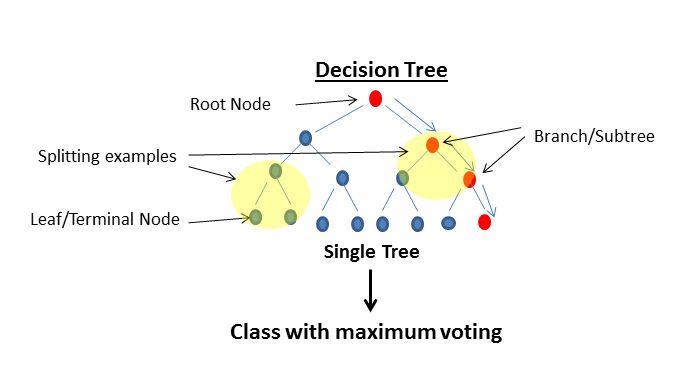
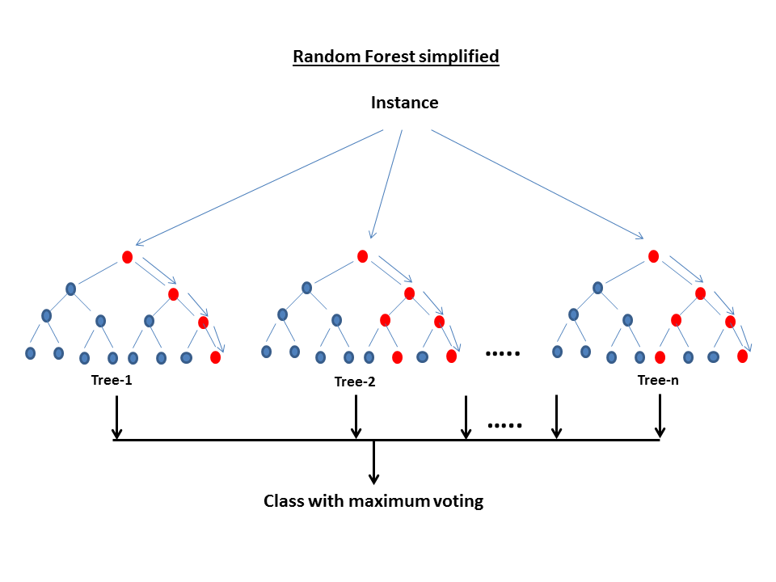

######*References:Various study material available online.*

####Before discussing Random Forest, let's try to understand What is a Decision Tree ? How does it work ?
Decision tree is a type of supervised learning algorithm (having a pre-defined target variable) that is mostly used in classification problems. It works for both categorical and continuous input and output variables. In this technique, we split the population or sample into two or more homogeneous sets (or sub-populations) based on most significant splitter / differentiator in input variables. Deision tree builds classification models in the form of a tree structure. It breaks down a dataset into smaller subsets. 

Classification is the problem of identifying to which set of categories a new observation belongs. It is a supervised learning model as the classifier already has a set of classified examples and from these examples, the classifier learns to assign unseen new examples. Eg: Assigning a given email into "spam" or "non-spam" category.

#####Let's look at the basic terminology used with Decision trees:
1. Root Node: It represents entire population or sample and this further gets divided into two or more homogeneous sets.
2. Splitting: It is a process of dividing a node into two or more sub-nodes.
3. Decision Node: When a sub-node splits into further sub-nodes, then it is called decision node.
4. Leaf/ Terminal Node: Nodes do not split is called Leaf or Terminal node.
5. Pruning: When we remove sub-nodes of a decision node, this process is called pruning. You can say opposite process of splitting.
6. Branch / Sub-Tree: A sub section of entire tree is called branch or sub-tree.
7. Parent and Child Node: A node, which is divided into sub-nodes is called parent node of sub-nodes where as sub-nodes are the child of parent node.




###What is Random Forest ? 
Random Forest is an ensemble classifier made using many decision tree models. Ensemble models combine the results from different models.



Random Forest is considered to be the solution of all data science problems. Random Forest is a versatile machine learning method capable of performing both regression and classification tasks. It also undertakes dimensional reduction methods based on Ginni value explained later, treats missing values, outlier values and other essential steps of data exploration, and does a fairly good job. 

####How does it work?
In Random Forest, we grow multiple trees as opposed to a single tree in CART model. To classify a new object based on attributes, each tree gives a classification and we say the tree "votes" for that class. The forest chooses the classification having the most votes (over all the trees in the forest) and in case of regression, it takes the average of outputs by different trees.It is a type of ensemble learning method, where a group of weak models combine to form a powerful model.


######It works in the following manner. Each tree is planted & grown as follows:

1. Assume number of cases in the training set is N. Then, sample of these N cases is taken at random but with replacement. This sample will be the training set for growing the tree.
2. If there are M input variables, a number m<M is specified such that at each node, m variables are selected at random out of the M. The best split on these m is used to split the node. The value of m is held constant while we grow the forest.
3. Each tree is grown to the largest extent possible and  there is no pruning.
4. Predict new data by aggregating the predictions of the ntree trees (i.e., majority votes for classification, average for regression).

####Advantages of Random Forest

* This algorithm can solve both type of problems i.e. classification and regression and does a decent estimation at both fronts.
* One of benefits of Random forest which excites me most is, the power of handle large data set with higher dimensionality. It can handle thousands of input variables and identify most significant variables so it is considered as one of the dimensionality reduction methods. Further, the model outputs Importance of variable, which can be a very handy feature (on some random data set).
* It has an effective method for estimating missing data and maintains accuracy when a large proportion of the data are missing.
* It has methods for balancing errors in data sets where classes are imbalanced.
* The capabilities of the above can be extended to unlabeled data, leading to unsupervised clustering, data views and outlier detection.
* Random Forest involves sampling of the input data with replacement called as bootstrap sampling. Here one third of the data is not used for training and can be used to testing. These are called the out of bag samples. Error estimated on these out of bag samples is known as out of bag error. Study of error estimates by Out of bag, gives evidence to show that the out-of-bag estimate is as accurate as using a test set of the same size as the training set. Therefore, using the out-of-bag error estimate removes the need for a set aside test set.

####Disadvantages of Random Forest

* It surely does a good job at classification but not as good as for regression problem as it does not give precise continuous nature predictions. In case of regression, it doesn't predict beyond the range in the training data, and that they may over-fit data sets that are particularly noisy.
* Random Forest can feel like a black box approach for statistical modelers - you have very little control on what the model does. You can at best - try different parameters and random seeds!

####Random Forest features:

1. One of the most accurate learning algorithms.
2. Works well for both classification and regression problems.
3. Runs efficintly on large databases.
4. Requires almost no input preparation.
5. Can be easily grown in parallel.
6. Methods for balancing error in unbalanced data sets.

#### Steps Involved in performing randomForest algorithm:
1. Data Collection.
2. Preparing and exploring the data (assuming data is clean).
      * Understnding data structure.
      * Feature selection (if required)
      * Creating Training and Test data set.
3. Training a model on data.
      * Predicting the target value for test data based on model.
4. Evaluate the model performance.
5. Improve the performance of model.

### *Case Study on Random Forest algorithm*

##### **Case Study -1**

#### **Objective of Analysis**: *Minimization of risk and maximization of profit on behalf of the bank.*
**Brief Description:** To minimize loss from the bank's perspective, the bank needs a decision rule regarding who to give approval of the loan and who not to. An applicant's demographic and socio-economic profiles are considered by loan managers before a decision is taken regarding his/her loan application.
The German Credit Data contains data on 20 variables and the classification whether an applicant is considered a Good or a Bad credit risk for 1000 loan applicants. Here is a link (https://onlinecourses.science.psu.edu/stat857/sites/onlinecourses.science.psu.edu.stat857/files/german_credit.csv) to the German Credit data. A predictive model developed on this data is expected to provide bank manager guidance for making a decision whether to approve a loan to a prospective applicant based on his/her profiles.

*Methodology: Random Forest classification*

**Step-1 Data Collection.**

```{r }
gc <- read.csv("german_credit.csv") # reading csv data files from defined directory as file has already downloaded and stored in the directory

## Taking back-up of the input file, in case the original data is required later
gc.bkup <- gc
head (gc) # To check top 6 values of all the variables in data set.
```

**Step-2 Preparing and exploring the data.**
Dataset variable details are available on this link (https://archive.ics.uci.edu/ml/datasets/Statlog+%28German+Credit+Data%29 )

There are 20 attributes/features, will take all the features for analysis as Random Forest will take care of the important features:

*Note: All the attributes' value are already converted to numeric and same data is available on the link as mentioned above.*

```{r }
str(gc) # understanding data structure, can see all the varaibles are integers including 'Creditability' which is our response variable.

#Creating Training and Test data set. Training data will be used to build model whereas test data will be used for validation and optimisation of model. 

set.seed(123)  # To get the same random sample
dat.d <- sample(1:nrow(gc),size=nrow(gc)*0.7,replace = FALSE) #random selection of 70% data.

train.gc <- gc[dat.d,] # 70% training data
test.gc  <- gc[-dat.d,] # remaining 30% test data

# Now Changing target variable(which is 'Creditability') to factor as we are doing classification analysis.
train.gc$Creditability <-as.factor(train.gc$Creditability) 
test.gc$Creditability <-as.factor(test.gc$Creditability)
   
```

**Step-3 Training a model on data.**
**Tuning parameter for randomForest algorithms are generally**
* *ntree* 
Number of trees to grow. This should not be set to too small a number, to ensure that every input row gets predicted at least a few times.By default ntree=500.
* *mtry* 
Number of variables randomly sampled as candidates at each split. Note that the default values are different for classification (sqrt(p) where p is number of variables and for  regression (p/3)

```{r include=FALSE}
#install.packages(randomForest) # to install randomForest packages as it carries randomForest function
library(randomForest)          # to call randomForest package
```
```{r }

#To identify optimum value of mtry, generally square root of total no of features (20) which is 4.47, so will try with 4 & 5 then will check for optimal value of mtry.

gc.rf.4 <-  randomForest(Creditability~.,data=train.gc, ntree=500,mtry=4)
gc.rf.5 <-  randomForest(Creditability~.,data=train.gc, ntree=500,mtry=5)

#Also, optimal 'mtry' can be calculated using 'tuneRF' function. Here we define improve as 0.01 else it will go in loop, so, if there is an improvement then only it will continue else it will stop.  

bstmtr<-tuneRF(train.gc,train.gc$Creditability,stepFactor = 1.2,improve = 0.01,trace=T,plot = T,ntreeTry = 1000)

# 'tuneRF function is also giving optimal 'mtry' as 4 which we have calculated using square root.

#Predicting the target value for test data based on model using 'predict' function.
gc_pred.4 <-predict(gc.rf.4,newdata = test.gc,type = 'class')
gc_pred.5 <-predict(gc.rf.5,newdata = test.gc,type = 'class')

```

**Step-4 Evaluate the model performance.**


```{r}

## Let's calculate the proportion of correct classification for mtry = 4 & 5 

ACC.4 <- 100 * sum(test.gc$Creditability == gc_pred.4)/NROW(test.gc$Creditability)  # For mtry = 4
ACC.5 <- 100 * sum(test.gc$Creditability == gc_pred.5)/NROW(test.gc$Creditability)  # For mtry = 5
ACC.4    #Accuracy is 75.67%
ACC.5    #Accuracy is 75.67%, which is same.

table(gc_pred.4 ,test.gc$Creditability)  # to check prediction against actual value in tabular form
# 42 & 185 are the correct prediction against actual wheras 14 & 59 are wrong prediction against actual.
```
```{r}
table(gc_pred.5 ,test.gc$Creditability)  # to check prediction against actual value in tabular form
# 41 & 186 are the correct prediction against actual wheras 13 & 60 are wrong prediction against actual.
```
```{r}
#check Gini Index(priority of attributes/variables)

importance(gc.rf.4)  # 'importance' function gives Gini value, the more the Ginni vale the more important is the feature.
varImpPlot(gc.rf.4)  # 'varImplot' plot the Ginni value versus features.
```

**OR Accuracy can also be calculated using 'caret' package and 'confusion matrix' function.** 

**Install.packages(caret)**, *To install 'caret' packages as it carries 'confusion matrix' function  which helps in the calculation of accuracy of model.*
```{r include=FALSE}

library(caret)
```
```{r evaluate=FALSE}

library(caret)

```
```{r}
confusionMatrix(gc_pred.4 ,test.gc$Creditability)

```

**Step-5 Improve the performance of model.**

* *For randomForest algorithm, the tuning parameters are 'mtry' and 'ntree'. as mentioned above in Step-3*
* *Let's try different 'mtry' value using for loop to find that whether accuracy can be further improved or not then will try different 'ntree' value to check any further improvement in accuracy or not.*

```{r}
#Using variable mtry with ntree=500
i=1                          # declaration to initiate for loop
rf.optm=1                     # declaration to initiate for loop
for (i in 1:20){ 
    rf.mod <-  randomForest(Creditability~., data=train.gc, mtry=i,ntree=500)
    gc_pred<-predict(rf.mod,newdata = test.gc,type = 'class')
    rf.optm[i] <- 100 * sum(test.gc$Creditability == gc_pred)/NROW(test.gc$Creditability)
    k=i  
    cat(k,'=',rf.optm[i],'\n')       # to print % accuracy 
}
# Maximum accuracy at mtry=15   

plot(rf.optm, type="b", xlab="mtry- Value",ylab="Accuracy level")  # to plot % accuracy wrt to mtry-value
```

```{r}
#Using variable ntree with mtry=15
j=1                          # declaration to initiate for loop
rf.optm.tree=1                     # declaration to initiate for loop
for (j in c(500,1000,1500,2000,2500)){ 
    rf.mod.tree <-  randomForest(Creditability~., data=train.gc, mtry=15,ntree=j)
    gc_pred.tree<-predict(rf.mod.tree,newdata = test.gc,type = 'class')
    rf.optm.tree[j] <- 100 * sum(test.gc$Creditability == gc_pred.tree)/NROW(test.gc$Creditability)
    n.tree=j  
    cat(n.tree,'=',rf.optm.tree[j],'\n')       # to print % accuracy 
}
# Maximum accuracy at mtry=7   

plot(rf.optm.tree,type="b", xlab="ntree - Value",ylab="Accuracy level")  # to plot % accuracy wrt to ntree-value
```

#####  **At mtry=15 and ntree=500, maximum accuracy achieved which is 79.33%. It is worse to class a customer as good when it is bad, than it is to class a customer as bad when it is good.** 

#####  *Further accuracy can be increased by optimising feature selections and repeating the above mentioned algorithm.* 
 
--------------------------------------------------------------------------------------------

